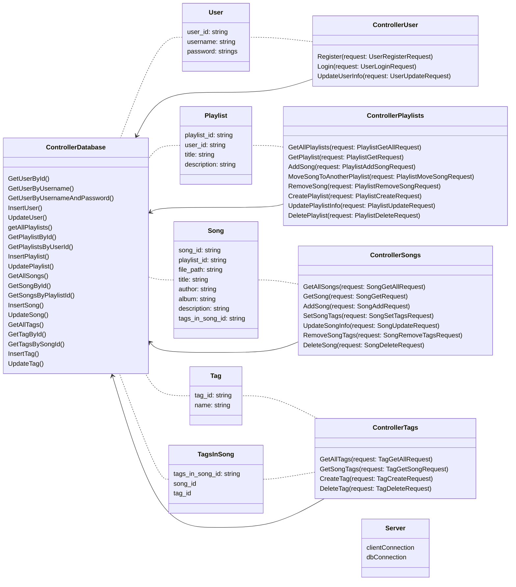

```mermaid
classDiagram
    direction RL

    User .. ControllerDatabase
    Playlist .. ControllerDatabase
    Song .. ControllerDatabase
    Tag .. ControllerDatabase
    TagsInSong .. ControllerDatabase
    
    ControllerUser ..User
    ControllerPlaylists .. Playlist
    ControllerSongs .. Song
    ControllerTags.. Tag
    ControllerTags.. TagsInSong

     ControllerUser --> ControllerDatabase
     ControllerSongs--> ControllerDatabase
     ControllerPlaylists--> ControllerDatabase
     ControllerTags--> ControllerDatabase

    class Server {
        clientConnection
        dbConnection
    }

    class ControllerUser{
        Register(request: UserRegisterRequest)
        Login(request: UserLoginRequest)
        UpdateUserInfo(request: UserUpdateRequest)
    }
    
    class ControllerSongs {
        GetAllSongs(request: SongGetAllRequest)
        GetSong(request: SongGetRequest)
        AddSong(request: SongAddRequest)
        SetSongTags(request: SongSetTagsRequest)
        UpdateSongInfo(request: SongUpdateRequest)
        RemoveSongTags(request: SongRemoveTagsRequest)
        DeleteSong(request: SongDeleteRequest)
    }
    
    class ControllerPlaylists {
        GetAllPlaylists(request: PlaylistGetAllRequest)
        GetPlaylist(request: PlaylistGetRequest)
        AddSong(request: PlaylistAddSongRequest)
        MoveSongToAnotherPlaylist(request: PlaylistMoveSongRequest)
        RemoveSong(request: PlaylistRemoveSongRequest)
        CreatePlaylist(request: PlaylistCreateRequest)
        UpdatePlaylistInfo(request: PlaylistUpdateRequest)
        DeletePlaylist(request: PlaylistDeleteRequest)
    }
    
    class ControllerTags {
        GetAllTags(request: TagGetAllRequest)
        GetSongTags(request: TagGetSongRequest)
        CreateTag(request: TagCreateRequest)
        DeleteTag(request: TagDeleteRequest)
    }
    
    class ControllerDatabase{
        GetUserById()
        GetUserByUsername()
        GetUserByUsernameAndPassword()
        InsertUser()
        UpdateUser()
        getAllPlaylists()
        GetPlaylistById()
        GetPlaylistsByUserId()
        InsertPlaylist()
        UpdatePlaylist()
        GetAllSongs()
        GetSongById()
        GetSongsByPlaylistId()
        InsertSong()
        UpdateSong()
        GetAllTags()
        GetTagById()
        GetTagsBySongId()
        InsertTag()
        UpdateTag()
    }
    
    class Playlist {
        playlist_id: string
        user_id: string
        title: string
        description: string
    }
    
    class Song {
        song_id: string
        playlist_id: string
        file_path: string
        title: string
        author: string
        album: string
        description: string
        tags_in_song_id: string
    }
    
    class Tag {
        tag_id: string
        name: string
    }
    
    class TagsInSong {
        tags_in_song_id: string
        song_id
        tag_id
    }
    
    class User {
        user_id: string
        username: string
        password: strings
    }

```