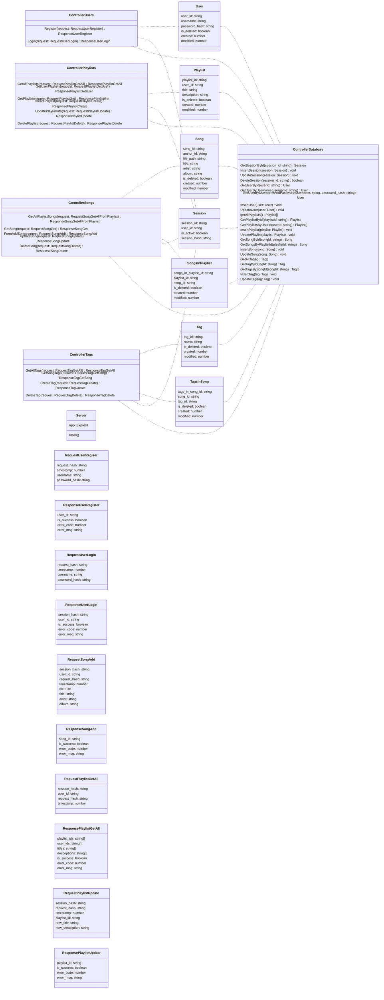

```mermaid
classDiagram
    direction LR

    User .. ControllerDatabase
    Session .. ControllerDatabase
    Playlist .. ControllerDatabase
    Song .. ControllerDatabase
    SongsInPlaylist .. ControllerDatabase
    Tag .. ControllerDatabase
    TagsInSong .. ControllerDatabase

    ControllerUsers .. User
    ControllerUsers .. Session
    ControllerPlaylists .. Playlist
    ControllerPlaylists .. Session
    ControllerSongs .. Song
    ControllerSongs .. SongsInPlaylist
    ControllerSongs .. Session
    ControllerTags.. Tag
    ControllerTags.. TagsInSong
    ControllerTags.. Session

     ControllerUsers .. ControllerDatabase
     ControllerSongs .. ControllerDatabase
     ControllerPlaylists .. ControllerDatabase
     ControllerTags .. ControllerDatabase

    class Server {
        app: Express
        listen()
    }

    class ControllerUsers{
        Register(request: RequestUserRegister) ResponseUserRegister
        Login(request: RequestUserLogin) ResponseUserLogin
    }

    class ControllerSongs {
        GetAllPlaylistSongs(request: RequestSongGetAllFromPlaylist) ResponseSongGetAllFromPlaylist
        GetSong(request: RequestSongGet) ResponseSongGet
        FormAddSong(request: RequestSongAdd) ResponseSongAdd
        UpdateSong(request: RequestSongUpdate) ResponseSongUpdate
        DeleteSong(request: RequestSongDelete) ResponseSongDelete
    }

    class ControllerPlaylists {
        GetAllPlaylists(request: RequestPlaylistGetAll) ResponsePlaylistGetAll
        GetUserPlaylists(request: RequestPlaylistGetUser) ResponsePlaylistGetUser
        GetPlaylist(request: RequestPlaylistGet) ResponsePlaylistGet
        CreatePlaylist(request: RequestPlaylistCreate) ResponsePlaylistCreate
        UpdatePlaylistInfo(request: RequestPlaylistUpdate) ResponsePlaylistUpdate
        DeletePlaylist(request: RequestPlaylistDelete) ResponsePlaylistDelete
    }

    class ControllerTags {
        GetAllTags(request: RequestTagGetAll) ResponseTagGetAll
        GetSongTags(request: RequestTagGetSong) ResponseTagGetSong
        CreateTag(request: RequestTagCreate) ResponseTagCreate
        DeleteTag(request: RequestTagDelete) ResponseTagDelete
    }

    class ControllerDatabase{
        GetSessionById(session_id: string) Session
        InsertSession(session: Session) void
        UpdateSession(session: Session) void
        DeleteSession(session_id: string) boolean
        GetUserById(userId: string) User
        GetUserByUsername(username: string) User
        GetUserByUsernameAndPassword(username: string, password_hash: string) User
        InsertUser(user: User) void
        UpdateUser(user: User) void
        getAllPlaylists() Playlist[]
        GetPlaylistById(playlistId: string) Playlist
        GetPlaylistsByUserId(userId: string) Playlist[]
        InsertPlaylist(playlist: Playlist) void
        UpdatePlaylist(playlist: Playlist) void
        GetSongById(songId: string) Song
        GetSongsByPlaylistId(playlistId: string) Song
        InsertSong(song: Song) void
        UpdateSong(song: Song) void
        GetAllTags() Tag[]
        GetTagById(tagId: string) Tag
        GetTagsBySongId(songId: string) Tag[]
        InsertTag(tag: Tag) void
        UpdateTag(tag: Tag) void
    }

    class Session {
        session_id: string
        user_id: string
        is_active: boolean
        session_hash: string
    }

    class Playlist {
        playlist_id: string
        user_id: string
        title: string
        description: string
        is_deleted: boolean
        created: number
        modified: number
    }

    class Song {
        song_id: string
        author_id: string
        file_path: string
        title: string
        artist: string
        album: string
        is_deleted: boolean
        created: number
        modified: number
    }

    class SongsInPlaylist {
        songs_in_playlist_id: string
        playlist_id: string
        song_id: string
        is_deleted: boolean
        created: number
        modified: number
    }

    class Tag {
        tag_id: string
        name: string
        is_deleted: boolean
        created: number
        modified: number
    }

    class TagsInSong {
        tags_in_song_id: string
        song_id: string
        tag_id: string
        is_deleted: boolean
        created: number
        modified: number
    }

    class User {
        user_id: string
        username: string
        password_hash: string
        is_deleted: boolean
        created: number
        modified: number
    }

    class RequestUserRegiser {
        request_hash: string
        timestamp: number
        username: string
        password_hash: string
    }

    class ResponseUserRegister {
        user_id: string
        is_success: boolean
        error_code: number
        error_msg: string
    }

    class RequestUserLogin {
        request_hash: string
        timestamp: number
        username: string
        password_hash: string
    }

    class ResponseUserLogin {
        session_hash: string
        user_id: string
        is_success: boolean
        error_code: number
        error_msg: string
    }

    class RequestSongAdd {
        session_hash: string
        user_id: string
        request_hash: string
        timestamp: number
        file: File
        title: string
        artist: string
        album: string
    }

    class ResponseSongAdd {
        song_id: string
        is_success: boolean
        error_code: number
        error_msg: string
    }

    class RequestPlaylistGetAll {
        session_hash: string
        user_id: string
        request_hash: string
        timestamp: number
    }

    class ResponsePlaylistGetAll {
        playlist_ids: string[]
        user_ids: string[]
        titles: string[]
        descriptions: string[]
        is_success: boolean
        error_code: number
        error_msg: string
    }

    class RequestPlaylistUpdate {
        session_hash: string
        request_hash: string
        timestamp: number
        playlist_id: string
        new_title: string
        new_description: string
    }

    class ResponsePlaylistUpdate {
        playlist_id: string
        is_success: boolean
        error_code: number
        error_msg: string
    }

```
